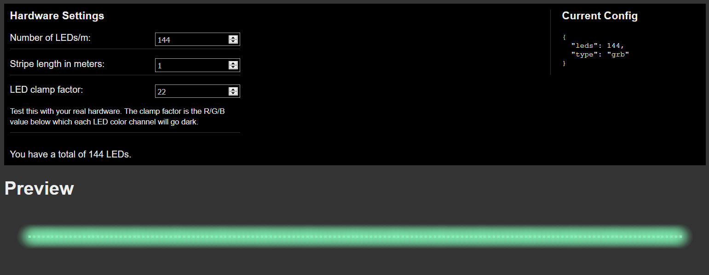

# LED net

This package allows controlling a WS2812 LED strip over UDP.

## Motivation

I started working on this project, because I am planning an (maybe) unusual setup:

I have - currently - two terrariums where I want to add controlled light for simulating sunrise/sunset scenarios.
The plan is to have a Raspberry Pi Zero W in each terrarium that is connected to a LED stripe and several sensors.

I want to have one additional Raspberry Pi 4 that is the "main server" and gathers all data, controls the light and
does other tasks. Therefore, I needed to have a slim client on the Zero Ws that only receives commands from my main server.  

## Server / SDK

The server can be imported in any nodeJS program and used to send commands to your LED strip or read its state.

Install it by executing `npm i -s lednet` - it can be used immediately.

This is an example that tries to discover a client on the network, and send color tweens in a two second interval:

```javascript
const led = require("lednet")();

(async function () {
    const clients = await led.discoverClients();

    console.log(`Found client at ${clients[0].address}`);

    const client = clients[0];

    client.configure({leds: 144, type: "grb"});

    setInterval(() => {
        client.tweenToColor(Math.random() * 255, Math.random() * 255, Math.random() * 255);
    }, 2000);
})();
```

## Client

The client runs on a raspberry pi with a connected WS2812 LED strip. It will process command messages
sent via UDP from a client in the same network and apply the commands on the LED strip.

For testing and/or debugging purposes, the client can also be started without a LED strip connected, or even
without running it on a raspberry. The hardware simulator will open in your browser and show live updates.



### Running the client simulator locally

Check out the project code to your harddrive. Run `npm i` in the project root. All sub dependencies for the client and
client UI will be installed as well.

> __Don't be afraid if the install fails!__    
> This will most likely happen, because the npm module that is used to actually control the hardware on the raspberry pi
> will only install correctly on a raspberry pi.

To start the client simulator, execute `npm run clientSimulator`. You should see the messages "Using Browser Test Connector"
 and "LED net client started".
 
To actually see something, you need to start the UI in a separate shell with `npm run clientUI`. The UI should open in your
browser automatically.
